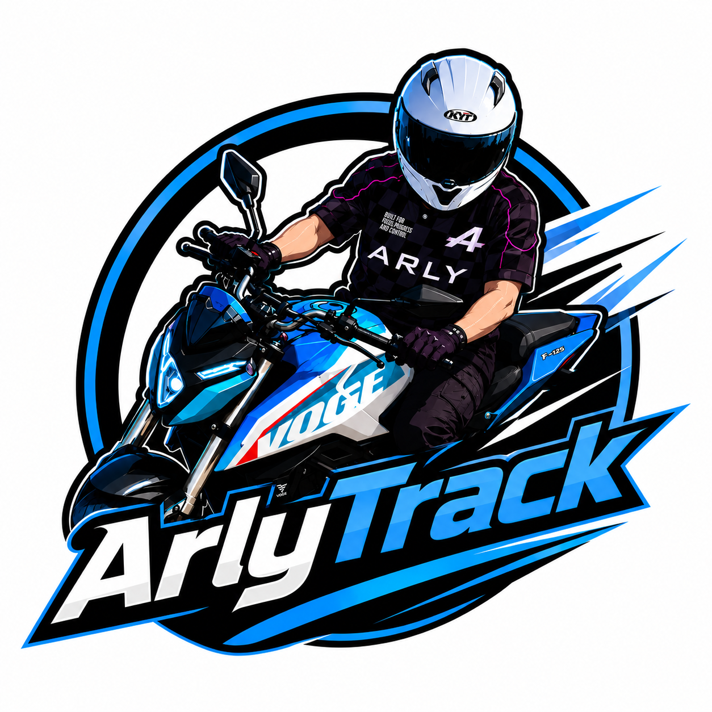

# ArlyTrack 🏍️💨

<p align="center">
  
</p>

<p align="center">
  <strong>Aplicación móvil abierta, privada y offline-first para registrar, analizar y compartir rutas en moto.</strong>
</p>

<p align="center">
  <a href="./LICENSE"></a>
  
  
  
  
  
</p>

---

## 🌟 ¿Qué es ArlyTrack?

**ArlyTrack** nace con una premisa simple: la mayoría de aplicaciones de rutas para moto actuales requieren registro obligatorio, sincronizan tu ubicación con servidores remotos, te bombardean con publicidad o cobran suscripciones mensuales por funciones esenciales como exportar un archivo GPX.

ArlyTrack es un **proyecto de código abierto (Open Source)** bajo licencia MIT, pensado para que cualquier motero pueda instalarlo libremente, usarlo sin conexión en puertos de montaña remotos y mejorarlo en comunidad.

---

## 🚀 Principales Características

### 🛡️ 100% Privada y Offline-First
* **Sin cuentas ni backend:** Tus rutas, fotos, perfil y vehículos se guardan exclusivamente en el almacenamiento local de tu teléfono.
* **Cero telemetría externa:** Nadie sabe dónde estás, a qué velocidad vas ni qué rutas recorres.

### 🧤 Diseñada Específicamente para la Moto
* **Interfaz Glove-Friendly:** Botones de acción táctiles de gran tamaño (68 px de alto) fáciles de presionar incluso con guantes de invierno o protecciones rígidas.
* **HUD de Alto Contraste:** Lectura instantánea de velocidad prominente, distancia recorrida, tiempo rodando, altitud y desnivel positivo acumulado.
* **Soporte Horizontal (Landscape):** Diseñado para moteros que llevan el smartphone montado en horizontal en el manillar o la barra de accesorios (HUD informativo a la izquierda, mapa central despejado y botonera a la derecha).
* **Protección Térmica de Batería:** La pantalla permanece activa mientras ruedas, pero al pulsar "Pausar" en una gasolinera o cafetería, se libera el bloqueo de pantalla para evitar que el sol directo sobrecaliente el procesador (*anti-thermal throttling*).

### 🛰️ Precisión Cinemática y Detección de Túneles
* **Odómetro sin deriva:** Cálculo con fórmula de Haversine a precisión completa (doble coma flotante IEEE 754) que elimina sesgos de redondeo.
* **Filtro de Desnivel con Histéresis:** Filtro IIR paso-bajo suave con máquina de estados Peak-Valley (umbral de 8 m) para ignorar el ruido vertical del GPS.
* **Soporte para Túneles Alpinos:** Detección de cruce de pasos subterráneos y túneles de hasta 10 minutos (600 s) a velocidades de hasta 220 km/h, sumando los kilómetros recorridos sin congelar el odómetro.
* **Aviso de Pérdida de Cobertura:** Si se interrumpe la señal del satélite o se apaga el GPS en marcha, el HUD avisa inmediatamente al piloto.

### 🗺️ Mapas Interactivos y Caché Local
* **3 Modos de visualización:** Estándar (OpenStreetMap), Satélite (Esri World Imagery) y Oscuro de alto contraste (CARTO).
* **Caché Offline en Montaña:** Integra capa de teselas en caché local (`CachedTileLayer` vía CacheStorage en WebView con contexto seguro HTTPS y poda automática de almacenamiento) para conservar mapas en puertos de montaña sin cobertura móvil.

### 🏍️ «Mi Garaje» Multivehículo
* Gestiona múltiples motos en un garaje local (nombre, consumo medio en L/100 km y coste del litro).
* Recálculo automático en tiempo real de litros consumidos y coste estimado en euros al finalizar la ruta.

### 📤 Portabilidad Total y Tarjetas Sociales
* **Exportación GPX 1.1 Estándar:** Exporta cualquier ruta con un solo toque y compártela de forma nativa a **Garmin Connect, Strava, Wikiloc o Google Earth**.
* **Tarjeta Vertical 9:16 para Redes:** Genera una imagen estilizada con el trazado sobre mapa, altimetría, foto de tu moto y resumen de telemetría lista para Instagram o WhatsApp.
* **Reproductor de Rutas:** Revive tus salidas paso a paso sobre el mapa con control de reproducción y métricas en cada punto.

---

## 📂 Arquitectura del Proyecto

El código está estructurado de forma modular y desacoplada, separando la matemática pura y el ciclo de vida del sistema de la capa de interfaz React:

```text
mototrack/
├── app/                  # Navegación y pantallas (Expo Router)
│   ├── (tabs)/
│   │   ├── index.tsx     # Pantalla principal: Mapa Leaflet + HUD + Botonera
│   │   ├── history.tsx   # Historial de rutas guardadas
│   │   └── _layout.tsx   # Barra de pestañas inferior
│   ├── modal.tsx         # Modal de perfil
│   └── _layout.tsx       # Layout raíz y temas
├── components/           # Componentes UI reutilizables
│   ├── MotorcycleMap.tsx # WebView con Leaflet, inyección O(1) y caché offline
│   ├── MetricCard.tsx    # Tarjetas de telemetría del HUD
│   ├── RiderProfileModal.tsx # Gestión de perfil y Garaje Multivehículo
│   ├── FinishRideModal.tsx   # Finalización, cambio de moto y consumo
│   ├── RideDetailModal.tsx   # Detalle de ruta y exportación GPX
│   ├── RouteReplayModal.tsx  # Reproductor dinámico del trazado
│   └── ShareCard.tsx     # Generador de tarjeta 9:16 para redes sociales
├── services/             # Lógica telemática desacoplada de la UI
│   ├── tracker.ts        # Núcleo GPS, filtros cinemáticos, odómetro y túneles
│   └── storage.ts        # Persistencia atómica dual (AsyncStorage + FileSystem)
├── types/                # Contratos estrictos TypeScript
│   └── ride.ts           # Interfaces de LiveMetrics, RideSession, Vehicle, etc.
├── utils/                # Algoritmos matemáticos y utilidades
│   ├── gpx.ts            # Generador XML oficial GPX 1.1 con sanitización
│   └── polyline.ts       # Simplificación Douglas-Peucker iterativa en Heap
└── docs/                 # Documentación de auditorías técnicas y rigor
```

---

## 💻 Puesta en Marcha en Local

### Requisitos Previos
* **Node.js:** Versión 18 o superior (recomendado Node 20 LTS o 22).
* **npm:** Gestor de paquetes incluido con Node.
* **Móvil Físico Android:** Recomendado para probar el GPS real y segundo plano (los emuladores no simulan con fidelidad la aceleración ni el modo Doze).

### Instalación

1. Clona el repositorio:
   ```bash
   git clone https://github.com/TU_USUARIO/arlytrack.git
   cd arlytrack
   ```

2. Instala las dependencias:
   ```bash
   npm install
   ```

3. Inicia el servidor de desarrollo Expo:
   ```bash
   npm start
   ```

### Opciones de Conexión
* **Red local (misma Wi-Fi):** `npm run start:lan`
* **Túnel remoto (si el firewall bloquea la LAN):** `npm run start:tunnel`

---

## 📦 Compilación y Generación del APK

ArlyTrack está configurado con **EAS (Expo Application Services)** para compilar directamente paquetes `.apk` instalables en Android.

### Opción A: Compilación en la Nube con EAS (Recomendado)
No requiere tener instalado Android Studio ni Java en tu máquina:
```bash
npm run build:apk
```
*(O de forma directa: `npx eas-cli build -p android --profile preview`)*

Al finalizar, la consola te devolverá un **código QR y enlace directo** para descargar el APK e instalarlo en tu móvil.

### Opción B: Compilación Local
Si dispones de Android SDK (`ANDROID_HOME`) y JDK 17 configurados en tu sistema:
```bash
npm run build:apk:local
```

### Opción C: Flujo Nativo con Gradle
```bash
npm run prebuild
cd android
./gradlew assembleRelease
```

---

## 🧪 Pruebas Automatizadas y Calidad de Código

El proyecto sigue una estricta política de verificación antes de cada entrega:

```bash
# 1. Comprobación de tipos TypeScript (estricto, sin 'any')
npx tsc --noEmit

# 2. Batería completa de pruebas unitarias con Jest (65 tests)
npx jest --ci

# 3. Auditoría de dependencias e integridad de Expo SDK
npx expo-doctor
```

La suite cubre exhaustivamente:
* Error del odómetro $< 0.5\%$ en simulaciones cinemáticas continuas de 1 hora a 10, 20, 50 y 90 km/h.
* Inmunidad al ruido vertical GPS mediante histéresis de altitud.
* Filtro de aceleración física ante saltos de señal.
* Persistencia atómica con rollback ante fallos de disco.
* Generación y validación del esquema XML de GPX 1.1.

---

## 🤝 ¿Cómo Contribuir?

¡Las contribuciones de la comunidad motera y de desarrollo son bienvenidas! Ya sea reportando un error, sugiriendo una mejora o aportando código:

1. **Haz un Fork** del proyecto.
2. **Crea una rama** para tu funcionalidad o fix (`git checkout -b feature/mi-nueva-mejora`).
3. **Escribe pruebas unitarias** para cualquier lógica nueva o corrección matemática en `services/__tests__/` o `utils/__tests__/`.
4. **Verifica que los tests y el tipado pasen al 100%:**
   ```bash
   npx tsc --noEmit && npx jest --ci
   ```
5. **Haz Commit** de tus cambios con mensajes descriptivos.
6. **Abre un Pull Request** explicando claramente qué resuelve tu aportación.

---

## 📄 Licencia

Este proyecto está bajo la Licencia **MIT** — consulta el archivo [LICENSE](./LICENSE) para más detalles. Puedes usarlo, estudiarlo, modificarlo y compartirlo con total libertad.

---

<p align="center">
  Hecho con pasión por las dos ruedas y el software libre. ¡Buenas rutas y ráfagas! ✌️🏍️
</p>
