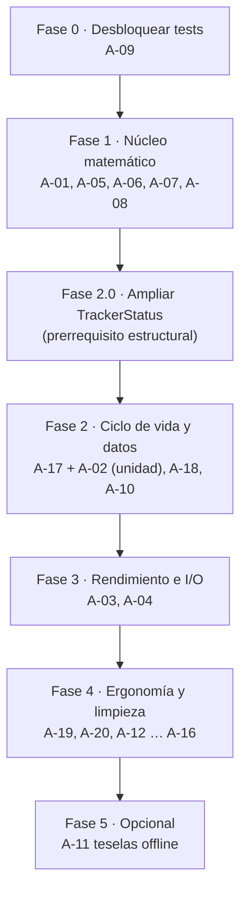

# Auditoría consolidada — ArlyTrack v2

**Proyecto:** ArlyTrack (`C:\IA\test\MOTOS\mototrack`)
**Fecha:** 4 de septiembre de 2026
**Commit base:** `ae2cbb1` (+ cambios sin commitear en el árbol de trabajo)
**Documento:** consolidación verificada de dos auditorías independientes

| Fuente | Aporte |
|---|---|
| `docs/AUDITORIA-2026-09-04.md` (Claude Opus 5) | Hallazgos A-01 … A-16 |
| `docs/RE-AUDITORIA-ANTIGRAVITY-2026-09-04.md` (Antigravity) | Validación de A-01 … A-16 + hallazgos nuevos A-17 … A-20 |
| Esta consolidación (Claude Opus 5) | Verificación cruzada de A-17 … A-20, corrección de 4 defectos del plan, reordenación por dependencias reales |

> **Este documento sustituye a los dos anteriores.** Trabajar contra él, no contra los originales.

---

## 0. Contexto para el implementador

| Dato | Valor |
|---|---|
| Stack | Expo SDK 57 · React Native 0.86.3 · React 19.2.3 · expo-router 57 · TypeScript 6.0 |
| Plataforma objetivo | **Android únicamente** (uso personal, sin publicación en tienda) |
| Perfil de uso | Un solo usuario, rutas en moto por carretera de montaña y ciudad, móvil en soporte de manillar o en el bolsillo |
| Persistencia | AsyncStorage local, sin backend |
| Mapa en vivo | Leaflet dentro de `react-native-webview` (`MotorcycleMap.tsx`) |
| Mapa de tarjeta | Teselas de red compuestas con SVG en React Native (`RouteVectorMap.tsx`) |
| Build | EAS managed (`android/` está vacío, no hay prebuild) |

**Estado de partida verificado:**

- `npx tsc --noEmit` → pasa limpio, cero errores.
- `npx jest --ci` → falla: 2 suites, **0 tests ejecutados** (ver A-09).

### Reglas de alcance

- **NO** reescribir la arquitectura. La separación `services/` (sin React) + pub/sub hacia la UI es correcta y se conserva.
- **NO** migrar a `react-native-maps`. Leaflet en WebView es una decisión deliberada y buena.
- **NO** añadir backend, cuentas ni sincronización. La app es local.
- **NO** cambiar la paleta de `constants/Colors.ts` ni el diseño del HUD.
- Cada hallazgo lleva **criterio de aceptación**. No cerrar sin cumplirlo.

---

## 1. Resumen ejecutivo

Arquitectura y tipado están bien. Los dos problemas de fondo son:

1. **Las métricas que muestra la app no son correctas.** El odómetro está mal a todas las velocidades y por debajo de ~18 km/h se queda congelado en 0 km de forma permanente (A-01).
2. **El ciclo de vida no es resistente a que Android mate el proceso**, que es el comportamiento normal del sistema. Hay dos vías distintas de pérdida de ruta: reanudación sin GPS (A-02) y borrado del estado antes de guardar (A-17).

| Severidad | Nº | IDs |
|---|---|---|
| 🔴 Crítico | 3 | A-01, A-02, A-17 |
| 🟠 Alto | 5 | A-03, A-04, A-05, A-06, A-18 |
| 🟡 Medio | 7 | A-07, A-08, A-09, A-10, A-11, A-19, A-20 |
| ⚪ Bajo | 5 | A-12 … A-16 |
| **Total** | **20** | |

### Correcciones aplicadas al plan de la re-auditoría

Cuatro puntos que se han rectificado en esta consolidación:

| # | Corrección |
|---|---|
| 1 | **Fórmula de A-01 mal transcrita.** La tabla de la re-auditoría escribía `Math.round(total + inc * 100) / 100`; el código real es `Math.round((total + inc) * 100) / 100`. Paréntesis mal colocado, operaciones distintas. Corregido en A-01 |
| 2 | **A-02 y A-17 colisionan.** Ambos estaban en la misma fase sin señalar que el fix de uno rompe el del otro. Requieren un nuevo valor en `TrackerStatus` y deben implementarse como una unidad. Ver **Fase 2.0** |
| 3 | **El fix de A-18 tenía un efecto secundario no mencionado**: detener el foreground service durante la pausa hace que Android pueda matar el proceso. Sustituido por degradación de precisión. Ver A-18 |
| 4 | **El fix de A-20 era vago** ("monitorear el estado de carga"). Sustituido por un mecanismo concreto basado en `onLoad` de `<Image>`. Ver A-20 |

Los 20 hallazgos han sido verificados contra el código fuente. **No hay falsos positivos.**

---

## 2. Hallazgos críticos

### 🔴 A-01 — El odómetro es incorrecto a todas las velocidades y se congela por debajo de 18 km/h

**Archivo:** `services/tracker.ts:196-201`

```ts
if (segKm > 0.003 || speedKmh >= 3.0) {
  distIncrement = segKm;
  activeState.metrics.totalDistanceKm =
    Math.round((activeState.metrics.totalDistanceKm + distIncrement) * 100) / 100;
}
```

> ⚠️ Atención a los paréntesis: es `Math.round((total + inc) * 100) / 100`. El acumulador **completo** se redondea en cada iteración.

**Qué pasa:** el acumulador se redondea a 2 decimales en **cada punto GPS**, en vez de acumular a precisión completa y redondear sólo al mostrar. Con `timeInterval: 1000` llega ~1 punto por segundo, así que cada incremento es pequeño y el redondeo lo destruye o lo amplifica.

- A 15 km/h el incremento por punto es 0,0042 km → `Math.round(0.42) / 100 = 0` → el total **nunca sube de 0,00**.
- A 20 km/h el incremento es 0,00556 km → redondea a 0,01 en cada punto → cuenta 36 km donde hay 20.

**Reproducción:**

```js
function simular(velocidadKmh, segundos) {
  const metrosPorSeg = velocidadKmh / 3.6;
  let total = 0, totalPreciso = 0;
  for (let s = 0; s < segundos; s++) {
    const segKm = metrosPorSeg / 1000;
    if (segKm > 0.003 || velocidadKmh >= 3.0) {
      total = Math.round((total + segKm) * 100) / 100;  // logica actual
      totalPreciso += segKm;                            // logica correcta
    }
  }
  return { mostrado: total, real: Math.round(totalPreciso * 100) / 100 };
}
[10, 15, 17, 18, 20, 30, 50, 90].forEach(v => console.log(v, simular(v, 3600)));
```

**Resultado medido (1 h a velocidad constante, 1 fix/s):**

| Velocidad | km mostrados | km reales | Error |
|---|---|---|---|
| 10 km/h | 0 | 10 | **−100 %** |
| 15 km/h | 0 | 15 | **−100 %** |
| 17 km/h | 0 | 17 | **−100 %** |
| 18 km/h | 0,03 | 18 | −99,8 % |
| 20 km/h | 36 | 20 | **+80 %** |
| 30 km/h | 36 | 30 | +20 % |
| 50 km/h | 36 | 50 | −28 % |
| 90 km/h | 104,09 | 90 | +15,7 % |

> El escenario asume velocidad constante y un fix por segundo, que es lo configurado (`timeInterval: 1000`, `distanceInterval: 2`). Con GPS real la magnitud varía, pero el sesgo estructural no desaparece: **nunca da la distancia correcta.**

**Impacto en cascada:** invalida la distancia, la velocidad media (derivada de ella) y el consumo/coste de combustible de `components/FinishRideModal.tsx:80-83`. Es toda la telemetría de la app.

**Fix:** acumular en precisión completa; redondear sólo en presentación.

```ts
activeState.metrics.totalDistanceKm += distIncrement;
```

Redondear con `.toFixed(2)` en el render (`app/(tabs)/index.tsx` ya lo hace) y al construir el `RideSession` en `FinishRideModal`. Mismo criterio para `avgSpeed` (`services/tracker.ts:250-253` y `:314-318`).

**Criterio de aceptación:** con el script anterior adaptado al código corregido, error < 0,5 % a 10, 15, 20, 50 y 90 km/h. Test unitario que lo cubra.

---

### 🔴 A-02 — Al restaurar una sesión interrumpida, el GPS no se reactiva

**Archivo:** `services/tracker.ts:525-537`

```ts
export async function restoreActiveSession(): Promise<ActiveRideState | null> {
  const savedState = await getActiveRideState();
  if (savedState && (savedState.status === 'recording' || savedState.status === 'paused')) {
    activeState = savedState;
    if (activeState.status === 'recording') {
      startDurationTimer();          // <-- solo arranca el reloj
    }
    notifyListeners();
    return activeState;
  }
  return null;
}
```

**Qué pasa:** restaura el estado y arranca el cronómetro, pero **nunca vuelve a llamar a `Location.watchPositionAsync`** ni comprueba `Location.hasStartedLocationUpdatesAsync(MOTOTRACK_LOCATION_TASK)`. La variable de módulo `foregroundWatcher` vale `null` tras un reinicio del proceso.

**Reproducción:** iniciar ruta → matar la app desde el gestor de tareas → reabrirla. El cronómetro corre y la UI dice "grabando", pero la distancia y la traza quedan congeladas indefinidamente.

**Por qué importa:** en Android es un escenario habitual, no un caso límite, y más aún con las capas de Xiaomi / Samsung / Huawei.

**Fix:** extraer el arranque de sensores de `startTracking()` a `attachLocationSources()` (idempotente: no duplicar el watcher si ya existe) y llamarla desde `startTracking()`, `resumeTracking()` y `restoreActiveSession()`.

> 🔗 **Depende de A-17.** Ver **Fase 2.0**: sin el estado `'finished'`, este fix rearma el GPS de rutas ya terminadas.

**Criterio de aceptación:** matar la app a mitad de ruta y reabrirla; la distancia debe seguir aumentando al moverse y la polilínea continuar desde donde estaba.

---

### 🔴 A-17 — El estado de la ruta se borra del disco antes de que el usuario la guarde

**Archivo:** `services/tracker.ts:516` (dentro de `stopTracking`) · consumidor en `app/(tabs)/index.tsx:207`

```ts
const finalState = { ...activeState };

activeState = { status: 'idle', /* ... reset ... */ };

await clearActiveRideState();   // <-- borra el disco YA
notifyListeners();

return finalState;              // unica copia viva: memoria del componente
```

**Qué pasa:** al pulsar «FINALIZAR», `stopTracking()` limpia AsyncStorage de inmediato y devuelve el estado final **sólo en memoria**. `app/(tabs)/index.tsx:207` lo guarda en el state de React y abre `FinishRideModal`, donde el usuario pone nombre y valoración.

Si durante esa ventana el proceso muere —una llamada entrante, la batería agotada, o Android liberando RAM tras horas de uso— **la ruta ya no existe en disco y todavía no se ha guardado**.

**Impacto:** pérdida definitiva e irrecuperable de una ruta completa de varias horas, en el momento de máxima frustración: justo al terminar.

**Fix:** no limpiar en `stopTracking()`. Marcar el estado como `'finished'`, persistirlo, y llamar a `clearActiveRideState()` únicamente cuando el usuario confirme **GUARDAR** (después de que `saveRide` haya resuelto) o **DESCARTAR**.

> 🔗 **Requiere ampliar `TrackerStatus`.** Ver **Fase 2.0**.

**Criterio de aceptación:** finalizar una ruta, matar la app con el modal de finalización abierto, reabrirla → la ruta debe seguir disponible para guardarla.

---

## 3. Hallazgos altos

### 🟠 A-03 — Se escribe el array completo de puntos en disco una vez por segundo

**Archivo:** `services/tracker.ts:273` (dentro de `processLocationUpdates`)

`saveActiveRideState(activeState)` serializa el objeto entero —incluido `points`— en cada fix GPS. Una ruta de 3 h a 1 Hz son ~10.000 puntos: `JSON.stringify` de más de 1 MB, una vez por segundo, sobre AsyncStorage.

**Impacto:** consumo de batería y bloqueos del hilo de JS que empeoran conforme la ruta se alarga.

**Fix:** throttle a 15–30 s mediante una variable de módulo `lastSaveAt`, con guardado **inmediato** en `pause`, `stop` y al marcar `'finished'`.

**Criterio de aceptación:** en 30 min de grabación, ≤ 150 escrituras a AsyncStorage (hoy ~1.800).

---

### 🟠 A-04 — El mapa reinyecta todos los puntos en cada actualización

**Archivo:** `components/MotorcycleMap.tsx:277-286` y `:295-302`

```ts
const pointsData = JSON.stringify(
  points.map((p) => ({ latitude: p.latitude, longitude: p.longitude }))
);
webViewRef.current?.injectJavaScript(
  `if (window.updateRoute) { window.updateRoute('${pointsData}'); } true;`
);
```

Cada punto nuevo dispara el `useEffect` y reserializa **la traza entera** para cruzar el puente al WebView. Coste O(n) por punto, O(n²) por ruta.

**Fix:** añadir `window.appendPoint(lat, lon)` al HTML de Leaflet (`polyline.addLatLng(...)`) y usarlo en el caso incremental. Reservar `updateRoute` para la carga inicial y el historial. Mantener `fitBoundsOnLoad` como está.

**Mejora adicional:** para rutas de más de 5.000 puntos, simplificar la polilínea con Douglas-Peucker **sólo para el render**, nunca para los datos guardados.

**Criterio de aceptación:** el string inyectado por punto nuevo debe tener tamaño constante, no proporcional a `points.length`.

---

### 🟠 A-05 — El desnivel positivo se infla con el ruido del GPS

**Archivo:** `services/tracker.ts:211-216`

```ts
if (altDiff >= 1) {
  activeState.metrics.elevationGainMeters += Math.round(altDiff);
}
```

Umbral de 1 metro entre muestras consecutivas a 1 Hz, cuando el error típico de altitud GPS es de ±10 m y fluctúa constantemente. Parado en un semáforo, cada oscilación positiva ≥ 1 m se suma.

**Fix:** umbral **acumulado** con histéresis, no por muestra. Mantener una `altitudReferencia`: sólo cuando la altitud actual la supera en 5–8 m, sumar la diferencia y actualizar la referencia; si baja más de ese umbral, mover la referencia hacia abajo sin sumar. Opcionalmente, media móvil de 5–10 muestras antes de comparar.

**Criterio de aceptación:** test con altitud constante + ruido gaussiano de ±10 m durante 600 muestras → `elevationGainMeters` < 20 m (hoy daría cientos).

---

### 🟠 A-06 — El velocímetro se queda congelado en el último valor al detenerse

**Archivo:** `services/tracker.ts:234`

`currentSpeed` sólo se asigna al procesar un fix nuevo (`:234`) y al pausar manualmente (`:437`). Nada lo lleva a 0 cuando dejan de llegar actualizaciones. Con `distanceInterval: 2`, al pararse la moto los fixes cesan y **el HUD sigue mostrando la última velocidad** (p. ej. "47 km/h" en un semáforo).

**Fix:** en `startDurationTimer()` (`services/tracker.ts:298`, ya corre cada segundo), forzar `currentSpeed = 0` si han pasado más de ~3 s desde el último punto. Guardar el timestamp del último fix en el estado del módulo.

**Criterio de aceptación:** detener el movimiento 5 s con la ruta grabando → el HUD muestra 0 km/h.

---

### 🟠 A-18 — El GPS sigue muestreando a máxima precisión durante las pausas

**Archivo:** `services/tracker.ts:432-447`

```ts
export async function pauseTracking(): Promise<void> {
  if (activeState.status !== 'recording') return;
  activeState.status = 'paused';
  activeState.pausedTime = Date.now();
  activeState.metrics.currentSpeed = 0;
  stopDurationTimer();
  if (foregroundWatcher) {
    foregroundWatcher.remove();     // solo quita el watcher de primer plano
    foregroundWatcher = null;
  }
  // ...  nunca toca MOTOTRACK_LOCATION_TASK
}
```

`pauseTracking()` elimina el watcher de primer plano pero **nunca llama a `Location.stopLocationUpdatesAsync(MOTOTRACK_LOCATION_TASK)`**. `processLocationUpdates` descarta los puntos porque `status !== 'recording'`, pero a nivel de sistema el GPS sigue muestreando a `Accuracy.BestForNavigation` cada segundo. En un descanso de 40–90 min es un derroche puro.

**Fix — degradar, no apagar.** Detener del todo el foreground service haría que Android pudiera **matar el proceso durante la pausa**, que es justo lo que A-02 y A-17 intentan evitar. En su lugar, volver a llamar a `startLocationUpdatesAsync` con opciones de bajo consumo:

```ts
accuracy: Location.Accuracy.Balanced,
timeInterval: 30000,
distanceInterval: 50,
```

Así el servicio y su notificación siguen vivos (proceso protegido) y el consumo cae drásticamente. En `resumeTracking()`, restaurar `BestForNavigation` / 1000 ms / 2 m junto con el watcher de primer plano.

**Criterio de aceptación:** con la ruta pausada, la tarea nativa sigue registrada pero con `Accuracy.Balanced`; la notificación del foreground service permanece visible.

---

## 4. Hallazgos medios

### 🟡 A-07 — «Tiempo Rodando» no mide tiempo rodando

**Archivo:** `services/tracker.ts:243-247` y `:308-312` · contrato en `types/ride.ts:23` · etiqueta en `app/(tabs)/index.tsx:352`

```ts
activeState.metrics.totalDurationSeconds = elapsedSeconds;
activeState.metrics.movingDurationSeconds = elapsedSeconds;   // identicos
```

`movingDurationSeconds` es el tiempo total menos las pausas **manuales**. El tipo declara `// Duración en movimiento (velocidad >= 3 km/h)`, pero ese filtro nunca se aplica: los semáforos cuentan como tiempo rodando y la "velocidad media" es media total.

**Decisión:** implementar el filtro real (acumular segundos sólo cuando `currentSpeed >= 3`). La alternativa —renombrar la etiqueta a "Tiempo total"— es aceptable pero pierde la métrica más interesante en ruta de montaña.

> 🔗 **Depende de A-06**: sin el reseteo a 0, `currentSpeed` nunca baja de 3 al pararse y el filtro no serviría de nada.

---

### 🟡 A-08 — La velocidad máxima es vulnerable a un único pico de GPS

**Archivo:** `services/tracker.ts:180-182`

El único filtro es `if (speedKmh > 300)`. Un glitch de 150–200 km/h (habitual al salir de un túnel o bajo un puente) queda grabado como máxima de la ruta y aparece en la tarjeta para compartir.

**Fix:** descartar el punto si la aceleración implícita no es física — p. ej. Δv > 30 km/h respecto al punto anterior en menos de 1 s. Mantener también el techo de 300.

---

### 🟡 A-09 — La suite de tests no ejecuta ni un solo test

```
FAIL components/__tests__/StyledText-test.js
  Could not locate module react-native/setup-env
Test Suites: 2 failed, 2 total
Tests: 0 total
```

Incompatibilidad entre `jest-expo@~57.0.5` y `react-native@0.86.3` en el resolver de `@react-native/jest-preset`. Los dos tests de Haversine escritos **nunca se han ejecutado**.

**Por qué va primero:** es bloqueante para validar A-01, A-05, A-07 y A-08, que son exactamente los hallazgos que necesitan verificación numérica.

**Fix:** alinear versiones de `jest-expo` / `@react-native/jest-preset` con RN 0.86, o añadir `moduleNameMapper` explícito en la config de Jest de `package.json`.

**Criterio de aceptación:** `npx jest --ci` ejecuta y pasa ≥ 2 tests.

---

### 🟡 A-10 — `POST_NOTIFICATIONS` se declara pero no se pide en runtime (Android 13+)

**Archivo:** `app.json:44`

El permiso se declara pero no hay ninguna solicitud en tiempo de ejecución (`expo-notifications` ni siquiera está en `package.json`). Desde Android 13 es un permiso de runtime: sin conceder, la notificación persistente del foreground service no se muestra, y algunas capas de fabricante son más agresivas matando servicios sin notificación visible.

**Fix:** solicitar el permiso antes de arrancar el foreground service en `startTracking()`.

**Limpieza asociada:** el array `android.permissions` de `app.json` declara **cada permiso dos veces**, en forma corta (`"POST_NOTIFICATIONS"`, línea 44) y prefijada (`"android.permission.POST_NOTIFICATIONS"`, línea 51). Es redundante; dejar una sola forma.

---

### 🟡 A-11 — No hay teselas offline (hueco de producto)

**Archivo:** `components/MotorcycleMap.tsx:114-122`

El mapa carga teselas de OSM, ArcGIS y CartoDB por red, sin caché. **El caso de uso son puertos de montaña, que es exactamente donde no hay cobertura.** La ruta demo del propio código es "Puerto de la Cruz Verde – El Escorial".

La grabación GPS sí funciona sin red (el GPS no necesita datos), así que **la ruta no se pierde**; lo que se ve gris es el mapa.

**Fix (mejora, no corrección):** cachear teselas con `localStorage` del WebView o con `expo-file-system` para una zona y unos zooms acotados. Es lo que más valor añadiría al uso real, pero **es lo último de la lista.**

---

### 🟡 A-19 — La pantalla se apaga durante la conducción

**Archivo:** `app/(tabs)/index.tsx`

El HUD está diseñado para verse en un soporte de manillar (botones de 68 px, alto contraste), pero no se impide el bloqueo de pantalla. A los 30–60 s sin tocar la pantalla, el móvil se apaga y hay que desbloquearlo con guantes en marcha.

**Fix:** `expo-keep-awake` condicionado a `status === 'recording' || status === 'paused'`. **Ya está instalada como dependencia transitiva (`expo-keep-awake@57.0.1`)**, así que es un import y un `useEffect`; añadirla a `package.json` como dependencia directa si se usa.

**Criterio de aceptación:** con una ruta grabando, la pantalla no se apaga sola; al finalizar, vuelve al comportamiento normal del sistema.

---

### 🟡 A-20 — La captura de la tarjeta 9:16 usa un `setTimeout` fijo de 250 ms

**Archivo:** `components/ShareCard.tsx:132-135`

```ts
// Breve pausa para asegurar que las teselas del mapa/foto y el trazado SVG estén listos
await new Promise((resolve) => setTimeout(resolve, 250));
const uri = await captureRef(cardRef, { format: 'png', quality: 0.98, result: 'tmpfile' });
```

La tarjeta incrusta `RouteVectorMap`, que **sí descarga teselas reales por red**: las compone como `<Image source={{ uri: tile.url }} />` bajo el trazado SVG (`components/RouteVectorMap.tsx:182`, URLs en `:59-70`). Con cobertura 3G en puerto de montaña, esas teselas tardan entre 800 ms y 2,5 s. La captura se dispara antes y genera tarjetas con parches grises o fondo negro.

**Fix concreto:** como son `<Image>` de React Native, exponen `onLoad` / `onError`. Llevar en `RouteVectorMap` un contador de teselas resueltas y notificar al padre vía callback (`onTilesReady`) cuando todas hayan terminado; `ShareCard` mantiene el botón de compartir en estado de carga hasta recibirlo, con **timeout de seguridad de 4 s** para no bloquearse si una tesela falla.

**Criterio de aceptación:** en red lenta simulada, la tarjeta generada no presenta teselas sin renderizar.

---

## 5. Hallazgos bajos

| ID | Hallazgo | Archivo | Acción |
|---|---|---|---|
| ⚪ **A-12** | `AGENTS.md` ordena leer los docs de **Expo v51** estando el proyecto en **Expo 57**. Ese fichero se carga en cada sesión de agente y dirige a documentación equivocada | `AGENTS.md:3` | Actualizar a `https://docs.expo.dev/versions/v57.0.0/` |
| ⚪ **A-13** | `react-native-maps` y `expo-linking` están en `package.json` con **cero imports**. `react-native-maps` arrastra el SDK de Google Maps al build nativo | `package.json` | Desinstalar ambas |
| ⚪ **A-14** | `getRides()` **escribe** la ruta demo en AsyncStorage en la primera lectura, convirtiéndola en una ruta real que el usuario debe borrar a mano | `services/storage.ts:80-84` | Devolver la demo sin persistirla |
| ⚪ **A-15** | Las URIs de `ImagePicker` se guardan tal cual; no se usa `expo-file-system` en ningún sitio. En Android el directorio de caché puede vaciarse por presión de almacenamiento y las fotos de perfil y de ruta se romperían | `components/RiderProfileModal.tsx:81-85`, `services/storage.ts` | Copiar a `documentDirectory` al seleccionar |
| ⚪ **A-16** | Filtro de precisión fijo en 25 m. En arranque en frío los primeros fixes suelen tener 30–50 m y se descartan todos, retrasando el inicio de la traza | `services/tracker.ts:151` | Umbral adaptativo: 50 m durante los primeros 30 s, luego 25 m |

**Nota sin acción:** los `timestamp` de la ruta demo son `1..12` (época 1970). Verificado que ni `RouteReplayModal` ni `RideDetailModal` usan ese campo, así que hoy es inocuo. Tenerlo presente si se añade análisis temporal del trazado.

---

## 6. Plan de ejecución por fases

Orden estricto de dependencias. **La Fase 2.0 es un prerrequisito estructural, no un hallazgo.**



### Fase 0 — Desbloqueo de pruebas
**A-09.** Sin esto no se puede validar numéricamente nada de la Fase 1.

### Fase 1 — Núcleo matemático y telemetría
**A-01** (acumulador de precisión completa) → **A-06** (velocímetro a 0) → **A-07** (tiempo rodando real, *depende de A-06*) → **A-05** (histéresis de desnivel) → **A-08** (filtro de aceleración).
Escribir un test unitario numérico por cada algoritmo.

### Fase 2.0 — Prerrequisito estructural: ampliar `TrackerStatus`

> ⚠️ **Sin este paso, los fixes de A-02 y A-17 se rompen mutuamente.**
> A-17 exige conservar el estado en disco después de finalizar. A-02 exige que `restoreActiveSession()` reenganche el GPS cuando encuentra un estado guardado. Combinados sin cambios, **al reabrir la app tras finalizar una ruta pendiente de guardar, el GPS se rearmaría para una ruta ya terminada.**

Pasos, en este orden:

1. En `types/ride.ts:15`, ampliar el tipo:
   ```ts
   export type TrackerStatus = 'idle' | 'recording' | 'paused' | 'finished';
   ```
2. Revisar **todos** los consumidores del tipo (`app/(tabs)/index.tsx` renderiza la barra de control por `status`; `services/tracker.ts` lo compara en `pauseTracking`, `resumeTracking` y `processLocationUpdates`). TypeScript señalará los `switch` y condicionales incompletos: `tsc --noEmit` debe quedar limpio antes de seguir.
3. En `restoreActiveSession()` (`services/tracker.ts:527`), mantener la condición de reenganche de sensores **sólo** para `'recording'` y `'paused'`. Un estado `'finished'` se restaura para mostrar el modal de guardado, **sin** tocar el GPS.

### Fase 2 — Ciclo de vida, GPS y resiliencia de datos
- **A-17 + A-02 como una única unidad de trabajo** (ambos tocan el mismo flujo y comparten el estado `'finished'`).
- **A-18** degradación de precisión en pausa (no apagado).
- **A-10** permiso de notificaciones en runtime + limpieza de permisos duplicados.

### Fase 3 — Rendimiento e I/O
- **A-03** persistencia throttled.
- **A-04** `appendPoint` incremental.

### Fase 4 — Ergonomía, calidad y limpieza
**A-19**, **A-20**, **A-12**, **A-13**, **A-14**, **A-15**, **A-16**.

### Fase 5 — Opcional
**A-11** teselas offline. No abordar hasta que todo lo anterior esté cerrado.

---

## 7. Lo que está bien y no hay que tocar

Ambas auditorías coinciden. Para evitar regresiones por exceso de celo:

1. **Servicios sin React.** `services/tracker.ts` y `services/storage.ts` no importan React. El pub/sub con `Set<StateListener>` y el clonado defensivo en `notifyListeners()` está bien resuelto.
2. **Tipado estricto real.** Cero `any`, `tsc --noEmit` limpio. Mantener el listón (incluido al ampliar `TrackerStatus`).
3. **Leaflet en WebView en lugar de `react-native-maps`.** Evita la API key de Google, la facturación y la configuración nativa, y da el modo satélite gratis. Decisión correcta.
4. **Detección de Expo Go** (`services/tracker.ts:22`) para no intentar background location donde no está disponible.
5. **Identidad visual "Electric Motorsport".** Paleta de `constants/Colors.ts`, botones de 68 px aptos para guantes, HUD de alto contraste. Diseñado para el caso de uso real.
6. **Cálculo de combustible.** Verificado: `RiderProfileModal` expone modelo, consumo (`:193`) y precio por litro (`:221`), y `FinishRideModal:80-83` los consume correctamente. Bien integrado.
7. **Fallback de velocidad por Haversine** cuando el sensor no da `speed` (`services/tracker.ts:170-179`).

---

## 8. Checklist de entrega

```
FASE 0
[x] A-09  npx jest --ci ejecuta y pasa 65/65 tests (5 suites limpias)

FASE 1
[x] A-01  Acumulador de odometro sin redondeo intermedio + test error < 0,5%
[x] A-06  currentSpeed cae a 0 tras 3 s sin fix
[x] A-07  movingDurationSeconds cuenta solo con v >= 3 km/h  (requiere A-06)
[x] A-05  Desnivel con histeresis + test con ruido sintetico (< 20 m)
[x] A-08  Filtro de aceleracion fisica en velocidad maxima

FASE 2.0  (prerrequisito estructural)
[x] TrackerStatus ampliado con 'finished'
[x] tsc --noEmit limpio tras revisar todos los consumidores
[x] restoreActiveSession NO rearma el GPS en estado 'finished'

FASE 2
[x] A-17  clearActiveRideState solo tras GUARDAR o DESCARTAR
[x] A-02  attachLocationSources() reengancha sensores
[x] A-18  Precision degradada en pausa (servicio sigue vivo)
[x] A-10  Permiso de notificaciones en runtime + permisos duplicados limpiados en app.json

FASE 3
[x] A-03  Persistencia throttled a <= 1 escritura / 15-30 s
[x] A-04  appendPoint incremental en el WebView de Leaflet

FASE 4
[x] A-19  KeepAwake condicionado a recording (liberado en pausa por seguridad termica EXT-02)
[x] A-20  Captura de tarjeta esperando onLoad de teselas (timeout 4 s)
[x] A-12  AGENTS.md apunta a los docs de Expo 57
[x] A-13  react-native-maps y expo-linking desinstaladas
[x] A-14  Ruta demo no se persiste
[x] A-15  Fotos copiadas a documentDirectory
[x] A-16  Umbral de precision adaptativo en arranque en frio

FASE 5  (implementada, pendiente de validación en dispositivo)
[~] A-11  Cache de teselas offline (CachedTileLayer con baseUrl HTTPS y poda LRU en WebView - Pendiente prueba física en modo avión)
```

### Verificación final

1. `npx tsc --noEmit` limpio.
2. `npx jest --ci` en verde, con los tests numéricos nuevos de la Fase 1.
3. **Prueba de campo:** ruta real de 20 min o más que incluya tramo urbano lento (< 20 km/h) y tramo de carretera, contrastando la distancia mostrada contra el cuentakilómetros de la moto o Google Maps.
4. **Prueba de resiliencia:** matar la app (a) a mitad de ruta y (b) con el modal de finalización abierto. En ambos casos la ruta debe sobrevivir.
