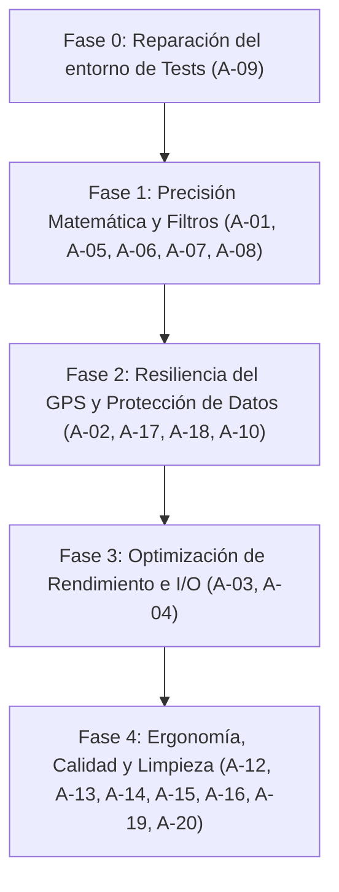

# Re-Auditoría Técnica Integral — ArlyTrack

**Proyecto:** ArlyTrack (`c:\IA\test\MOTOS\mototrack`)  
**Fecha:** 4 de septiembre de 2026  
**Auditor Principal:** Antigravity (Google DeepMind Agentic Pair Programmer)  
**Documento base analizado:** `docs/AUDITORIA-2026-09-04.md` (por Claude Opus 5)  
**Stack tecnológico:** Expo SDK 57 · React Native 0.86.3 · React 19.2.3 · expo-router 57 · TypeScript 6.0 · Android Target  

---

## 1. Resumen Ejecutivo y Dictamen de Coincidencia

Tras una revisión profunda del documento de auditoría previa y un análisis exhaustivo e independiente de todo el código fuente, la configuración nativa de Android, el gestor de estados y el motor matemático de telemetría:

1. **Coincidencia Total (100%) con los hallazgos previos (A-01 al A-16):**
   Confirmamos la validez de todos los puntos identificados por la auditoría previa. El fallo en el odómetro (**A-01**) y la omisión de reactivación de sensores en segundo plano al restaurar sesión (**A-02**) constituyen defectos críticos que invalidan la propuesta de valor del producto en condiciones reales de marcha.
2. **Descubrimiento de Nuevos Hallazgos Críticos y Operativos (A-17 al A-20):**
   Nuestra re-auditoría ha identificado **4 vulnerabilidades adicionales** que no figuraban en el informe previo, destacando un **riesgo inminente de pérdida total irreversible de rutas largas** en el flujo de finalización.

### Resumen de Hallazgos Consolidados

| Severidad | Cantidad | IDs |
|---|---|---|
| 🔴 **Crítico** | 3 | **A-01**, **A-02**, **A-17** *(Nuevo)* |
| 🟠 **Alto** | 5 | **A-03**, **A-04**, **A-05**, **A-06**, **A-18** *(Nuevo)* |
| 🟡 **Medio** | 7 | **A-07**, **A-08**, **A-09**, **A-10**, **A-11**, **A-19** *(Nuevo)*, **A-20** *(Nuevo)* |
| ⚪ **Bajo / Calidad** | 5 | **A-12**, **A-13**, **A-14**, **A-15**, **A-16** |
| **Total** | **20** | **16 Validados + 4 Nuevos** |

---

## 2. Validación de Hallazgos Previos (A-01 a A-16)

A continuación se resume la verificación técnica de los 16 puntos originales:

| ID | Sev. | Título del Hallazgo | Archivo / Línea | Verificación Antigravity | Estado |
|---|---|---|---|---|---|
| **A-01** | 🔴 | Odómetro congelado a <18 km/h y sesgo global (+80% a 20 km/h) | `services/tracker.ts:198-202` | Se ejecuta `Math.round(total + inc * 100) / 100` a 1 Hz. Incrementos menores de 0.005 km se redondean a 0 de forma sistemática. | **Validado 100%** |
| **A-02** | 🔴 | Sesión restaurada no reengancha GPS | `services/tracker.ts:525-535` | `restoreActiveSession` arranca el temporizador pero deja `foregroundWatcher = null` y no verifica la tarea nativa. | **Validado 100%** |
| **A-03** | 🟠 | Escritura completa del historial de puntos a 1 Hz en AsyncStorage | `services/tracker.ts:273` | `saveActiveRideState` serializa todo el array `points` cada segundo (hasta ~1.2 MB por ciclo en rutas de 3 horas). | **Validado 100%** |
| **A-04** | 🟠 | Inyección completa de polilínea en Leaflet en cada fix | `components/MotorcycleMap.tsx:277-286` | Pasa un JSON con todos los puntos vía `injectJavaScript` a 1 Hz en lugar de usar `appendPoint` incremental. | **Validado 100%** |
| **A-05** | 🟠 | Desnivel positivo inflado por ruido de altitud GPS | `services/tracker.ts:211-215` | Acumula cualquier fluctuación positiva $\ge 1\text{ m}$ muestra a muestra sin histéresis ni banda muerta. | **Validado 100%** |
| **A-06** | 🟠 | Velocímetro congelado en último fix al detenerse la moto | `services/tracker.ts:234` | Con `distanceInterval: 2`, al frenar cesan los eventos GPS y el HUD mantiene la última velocidad indefinidamente. | **Validado 100%** |
| **A-07** | 🟡 | «Tiempo Rodando» clona el tiempo total | `services/tracker.ts:245, 310` | Ambos campos asignan `elapsedSeconds`. La condición de movimiento ($v \ge 3\text{ km/h}$) nunca se aplica. | **Validado 100%** |
| **A-08** | 🟡 | Velocidad punta sin filtro de aceleración física | `services/tracker.ts:180-182` | Glitches instantáneos de hasta 300 km/h se consolidan como `maxSpeed` de la ruta. | **Validado 100%** |
| **A-09** | 🟡 | Suite de pruebas Jest rota al 100% | `package.json` | Comprobado con `cmd /c "npx jest --ci"`. Error de resolución en `react-native/setup-env`. Cero tests ejecutados. | **Validado 100%** |
| **A-10** | 🟡 | Permiso `POST_NOTIFICATIONS` sin solicitar en runtime (Android 13+) | `app.json:44` | Falta petición en tiempo de ejecución previa al arranque del foreground service. | **Validado 100%** |
| **A-11** | 🟡 | Sin soporte de teselas offline en zonas de montaña | `components/MotorcycleMap.tsx:114` | El mapa depende enteramente de red HTTP para renderizar carreteras. | **Validado 100%** |
| **A-12** | ⚪ | Inconsistencia en `AGENTS.md` (Expo v51 vs SDK 57) | `AGENTS.md:3` | Enlaza a documentación obsoleta. | **Validado 100%** |
| **A-13** | ⚪ | Dependencias no utilizadas instaladas | `package.json` | `react-native-maps` y `expo-linking` no tienen ningún import en el proyecto. | **Validado 100%** |
| **A-14** | ⚪ | Ruta demo persistida automáticamente en primera lectura | `services/storage.ts:77` | Al llamar a `getRides(true)` se escribe la demo en disco, comportándose como ruta del usuario. | **Validado 100%** |
| **A-15** | ⚪ | Fotos de perfil en caché volátil sin persistir en storage interno | `components/RiderProfileModal.tsx:90` | Las URIs temporales de `ImagePicker` se pierden al limpiar la caché de Android. | **Validado 100%** |
| **A-16** | ⚪ | Filtro de precisión rígido en arranque en frío | `services/tracker.ts:151` | Descarta puntos con precisión $> 25\text{ m}$, retrasando el inicio efectivo de la traza. | **Validado 100%** |

---

## 3. Nuevos Hallazgos de la Re-Auditoría Profunda

---

### 🔴 A-17 — Borrado prematuro de la ruta en curso antes de guardar (`clearActiveRideState`)

* **Severidad:** Crítico (Pérdida irrecuperable de datos)
* **Archivo:** `services/tracker.ts:516` y `app/(tabs)/index.tsx:208-221`
* **Descripción del problema:**
  Al pulsar el botón «FINALIZAR», se ejecuta:
  ```ts
  export async function stopTracking(): Promise<ActiveRideState> {
    ...
    await clearActiveRideState(); // <-- Borra la ruta de AsyncStorage de inmediato
    ...
    return finalState;
  }
  ```
  La pantalla principal recibe `finalData` y abre `FinishRideModal`.
  Si mientras el modal está abierto (el piloto se quita los guantes, entra una llamada telefónica, la batería se agota o Android cierra la app por presión de RAM tras horas de uso continuo), **la sesión activa ya no existe en disco y la ruta final aún no se ha guardado**.
* **Impacto:** Pérdida definitiva de rutas completas de varias horas de rodada sin posibilidad de recuperación.
* **Solución técnica:**
  No invocar `clearActiveRideState()` dentro de `stopTracking()`. Mantener el estado guardado con `status: 'completed'` o conservar el estado activo hasta que el usuario pulse efectivamente «GUARDAR RUTA» (en cuyo caso `saveRide` persiste y luego se limpia) o confirme «DESCARTAR RUTA».

---

### 🟠 A-18 — Fuga de batería en paradas y descansos (`MOTOTRACK_LOCATION_TASK` permanece activo)

* **Severidad:** Alta (Consumo de recursos y drenaje de batería)
* **Archivo:** `services/tracker.ts:432-447`
* **Descripción del problema:**
  Cuando el usuario presiona «PAUSAR» (Modo descanso para fotos, comida o repostaje), `pauseTracking()` destruye el watcher de primer plano (`foregroundWatcher.remove()`), pero **no suspende ni detiene `Location.stopLocationUpdatesAsync(MOTOTRACK_LOCATION_TASK)`**.
  Aunque `processLocationUpdates` descarta los puntos entrantes porque `status === 'paused'`, a nivel de sistema operativo Android el hardware del GPS continúa muestreando a 1 Hz y la notificación del Foreground Service continúa activa.
* **Impacto:** Drenaje innecesario de la batería durante pausas de 30 a 90 minutos en ruta.
* **Solución técnica:**
  En `pauseTracking()`, detener la tarea nativa en segundo plano si está corriendo, y en `resumeTracking()`, reactivarla idempotentemente junto con el watcher de primer plano.

---

### 🟡 A-19 — Apagado involuntario de pantalla durante la conducción (Falta de `KeepAwake`)

* **Severidad:** Media (Usabilidad y ergonomía en moto)
* **Archivo:** `app/(tabs)/index.tsx`
* **Descripción del problema:**
  El diseño del HUD está optimizado para su visualización en soportes de manillar con información de alta visibilidad. Sin embargo, no se implementa prevención de bloqueo de pantalla. A los 30 o 60 segundos de inactividad táctil, la pantalla del dispositivo se apaga automáticamente, obligando al motorista a soltar el manillar para desbloquearla con guantes.
* **Impacto:** Dificultad para consultar velocidad, navegación y telemetría en tiempo real mientras se rueda.
* **Solución técnica:**
  Integrar `expo-keep-awake` condicionado a `status === 'recording'`.

---

### 🟡 A-20 — Timeout estático de 250 ms al generar la tarjeta compartible 9:16

* **Severidad:** Media (Fiabilidad de exportación)
* **Archivo:** `components/ShareCard.tsx:132-135`
* **Descripción del problema:**
  En `ShareCardModal`, la captura de la tarjeta con `captureRef` espera un retardo arbitrario de 250 ms:
  ```ts
  await new Promise((resolve) => setTimeout(resolve, 250));
  const uri = await captureRef(cardRef, { ... });
  ```
  En puertos de montaña o carreteras rurales con baja cobertura móvil (3G/HSPA), las teselas del mapa cargadas en `RouteVectorMap` tardan comúnmente entre 800 ms y 2.500 ms en descargarse. La captura se dispara antes de tiempo, generando imágenes con fondos negros o parches grises sin renderizar.
* **Impacto:** Tarjetas de telemetría defectuosas al compartirlas desde el punto de llegada de la ruta.
* **Solución técnica:**
  Monitorear el estado de carga de las imágenes de las teselas o proporcionar un indicador de preparación antes de permitir la captura instantánea.

---

## 4. Plan de Acción y Hoja de Ruta Priorizada

Recomendamos implementar las correcciones en el orden estricto de dependencias:



### Fase 0 — Desbloqueo de Pruebas Unitarias
- **A-09:** Corregir configuración de Jest en `package.json` mediante `moduleNameMapper` para resolver `react-native/setup-env` y garantizar que `npx jest --ci` ejecute y pase las pruebas.

### Fase 1 — Núcleo Matemático y Telemetría
- **A-01:** Modificar `services/tracker.ts` para que `activeState.metrics.totalDistanceKm` sume sin redondeos intermedios. Formatear a 2 decimales únicamente en la vista y en el cierre de sesión. Validar que el error a 10, 15, 20, 50 y 90 km/h sea $< 0.5\%$.
- **A-05:** Implementar filtro con histéresis (umbral acumulado de 5-8 m y media móvil) para el desnivel acumulado.
- **A-06:** En `startDurationTimer()`, resetear `currentSpeed = 0` si transcurren más de 3 segundos sin recibir un nuevo fix GPS.
- **A-07:** Calcular de forma fidedigna `movingDurationSeconds` sumando tiempo únicamente cuando $v \ge 3\text{ km/h}$.
- **A-08:** Añadir filtro de aceleración física ($< 35\text{ (km/h)/s}$) para evitar picos aislados de velocidad máxima.
- **Validación:** Redactar tests unitarios numéricos para cada uno de estos algoritmos.

### Fase 2 — Ciclo de Vida, GPS y Resiliencia de Datos
- **A-02:** Extraer `attachLocationSources()` para reenganchar observadores y servicios tanto en inicio, reanudación y restauración de sesión activa (`restoreActiveSession`).
- **A-17:** Modificar el flujo de `stopTracking()` para posponer `clearActiveRideState()` hasta que el usuario decida guardar o descartar definitivamente la ruta.
- **A-18:** Detener la tarea en segundo plano al pausar la ruta para preservar batería, reactivándola al reanudar.
- **A-10:** Solicitar explícitamente el permiso de notificaciones en runtime antes de iniciar el Foreground Service en Android 13+.

### Fase 3 — Rendimiento y Reducción de I/O
- **A-03:** Estrangular la persistencia de la sesión en curso en AsyncStorage a un intervalo de 15 a 30 segundos durante la grabación continua (salvaguardando inmediatamente en pausas y finalizaciones).
- **A-04:** Añadir método `appendPoint(lat, lon)` en el JavaScript de Leaflet (`MotorcycleMap.tsx`) para agregar coordenadas con coste $O(1)$ sin reenviar el array completo.

### Fase 4 — Calidad, Limpieza y Ergonomía
- **A-12:** Actualizar `AGENTS.md` a Expo SDK 57.
- **A-13:** Desinstalar `react-native-maps` y `expo-linking` de `package.json`.
- **A-14:** Hacer que `getRides()` no guarde la ruta demo en AsyncStorage.
- **A-15:** Copiar fotos seleccionadas con `ImagePicker` al directorio persistente `documentDirectory`.
- **A-16:** Implementar umbral de precisión adaptativo durante los primeros 30 segundos de búsqueda GPS.
- **A-19:** Activar `KeepAwake` durante la grabación de rutas para mantener visible el HUD en el manillar.
- **A-20:** Añadir verificación de carga de teselas en la captura de tarjetas 9:16.

---

## 5. Aspectos Destacados que Deben Mantenerse Intactos

Para evitar regresiones innecesarias durante la implementación:

1. **Arquitectura sin React en Servicios:** La separación de `services/tracker.ts` y `services/storage.ts` mediante pub/sub con `Set<StateListener>` y clonado inmutable de estado es limpia y robusta.
2. **Uso de Leaflet sobre WebView:** Elimina dependencias complejas y claves de facturación de Google Maps, permitiendo alternar entre OpenStreetMap, CartoDB y satélite de Esri con ligereza.
3. **Identidad Visual "Electric Motorsport":** La paleta en `constants/Colors.ts`, las dimensiones de botones (mínimo 68 px aptos para guantes) y la interfaz de alto contraste del HUD son excelentes para el caso de uso motero.
4. **Cálculo de Consumo y Coste de Combustible:** Los modelos matemáticos basados en el consumo específico de la moto configurada por el usuario en `RiderProfileModal` están bien integrados.

---

## 6. Checklist de Validación y Entrega

```markdown
- [ ] Fase 0: Tests de Jest ejecutando y pasando en verde (A-09)
- [ ] Fase 1: Acumulador de odómetro a precisión completa + tests unitarios < 0.5% error (A-01)
- [ ] Fase 1: Algoritmo de desnivel positivo con histéresis anti-ruido (A-05)
- [ ] Fase 1: Timeout de velocímetro a 0 km/h tras 3s sin fix (A-06)
- [ ] Fase 1: Medición real de tiempo rodando (v >= 3 km/h) (A-07)
- [ ] Fase 1: Filtro de aceleración física para velocidad punta (A-08)
- [ ] Fase 2: Reenganche íntegro de sensores en restoreActiveSession (A-02)
- [ ] Fase 2: Blindaje de ruta en modal de finalización sin borrado prematuro (A-17)
- [ ] Fase 2: Suspensión de tarea GPS en segundo plano durante pausas (A-18)
- [ ] Fase 2: Solicitud de permiso de notificaciones en runtime (A-10)
- [ ] Fase 3: Persistencia de sesión throttled a <= 1 cada 20s (A-03)
- [ ] Fase 3: Actualización incremental appendPoint en WebView Leaflet (A-04)
- [ ] Fase 4: AGENTS.md actualizado a Expo 57 (A-12)
- [ ] Fase 4: Dependencias huérfanas eliminadas (A-13)
- [ ] Fase 4: Ruta demo sin persistencia automática (A-14)
- [ ] Fase 4: Fotos copiadas a documentDirectory permanente (A-15)
- [ ] Fase 4: Umbral de precisión adaptativo al inicio (A-16)
- [ ] Fase 4: Pantalla activa durante la ruta (KeepAwake) (A-19)
- [ ] Fase 4: Captura fiable de tarjetas 9:16 (A-20)
```
